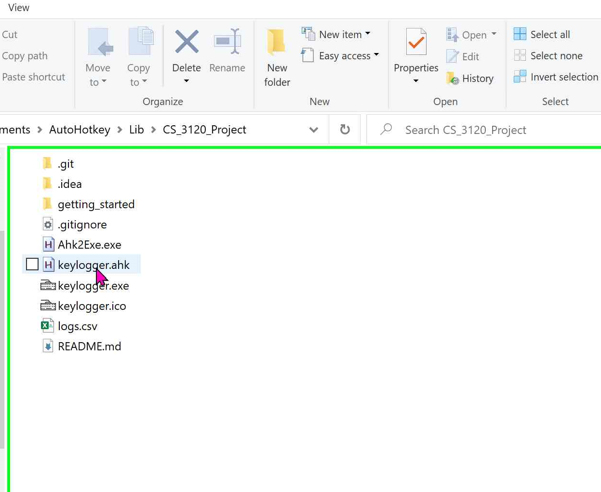
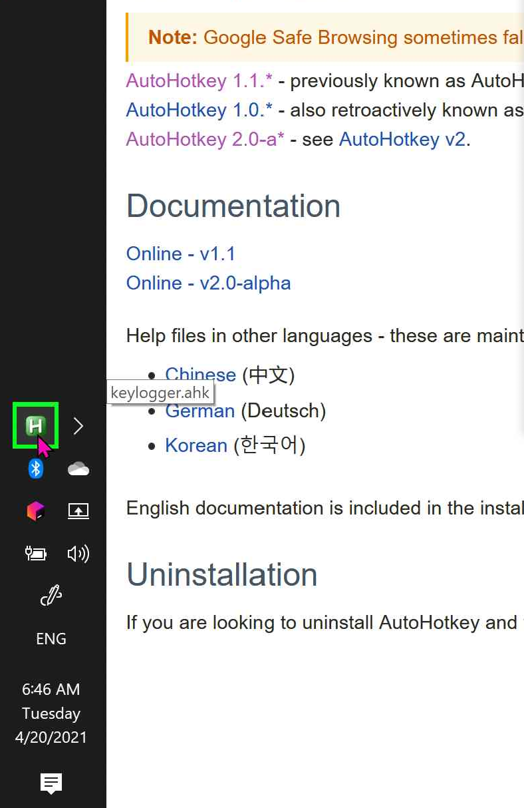
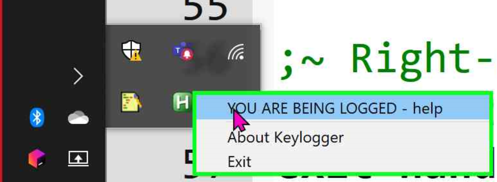
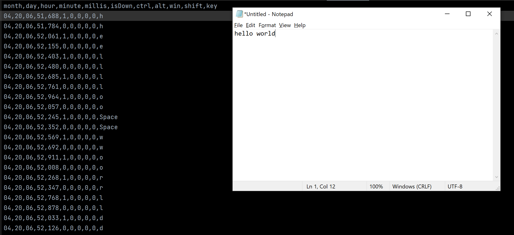

# Getting Started

In order to help us collect data for this project, we need volunteers that can donate some of their
typing data. Please read [this section](https://github.com/GalacticWafer/CS_3120_Project/blob/main/README.md) to learn more about how
we use volunteer data.

1. Use your preferred method to clone a copy of the repo to your personal computer

eg: `git clone https://github.com/GalacticWafer/CS_3120_Project.git`

2. From the project directory, there are two ways to run the script
    + Option 1: Run `.ahk` scripts natively on Windows
        - [Download & install AutoHotkey](https://www.autohotkey.com/download/)
        - Run the un-compiled script available in the repo at `\keylogger.ahk`
    + Option 2: Run the pre-compiled executable
        - The keylogger is available in the repo at `\keylogger.exe`

3. When you are ready to start the keylogger, double-click on `keylogger.ahk` or `keylogger.exe`.
   

5. You will see a green 'H' appear in the taskbar. Whenever this icon is present, an AutoHotkey
   script or executable is running.
   

6. Right-clicking the icon  brings up the context menu. Here, you can the about section, help 
   section, or exit if you are done running the keylogger.
   

If you ever want to take a look at the data that has been generated, open the `/logs.csv` file to
check it out yourself.

## Submitting User data

If you are reading this, you are probably in our class. Get in touch with one of us through Teams to submit your data:

- Malcolm Johnson https://galacticwafer.github.io
- Adam Wojdyla https://github.com/awojdyla89
